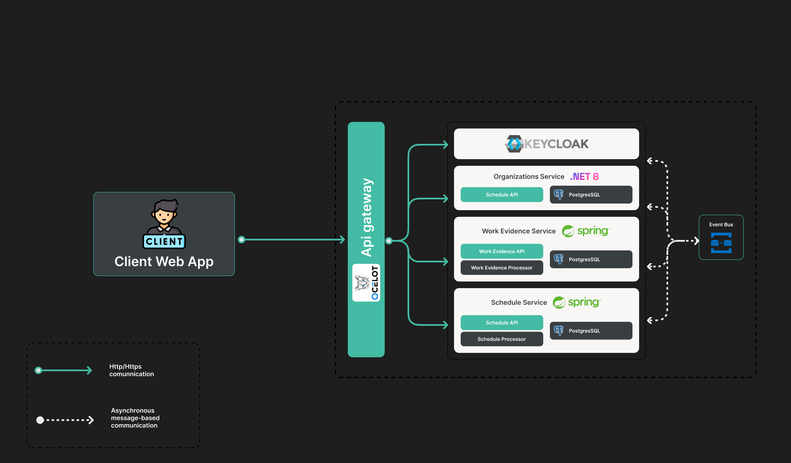

# KeepItUp.MagJob

KeepItUp.MagJob is a microservices-based job management platform designed to help businesses manage their workflow, team communications, and time tracking effectively.

## Architecture

The application is built using a microservices architecture with the following components:

- **Client Application**: Angular-based frontend
- **API Gateway**: Entry point for all client requests (.NET)
- **Identity Service**: Handles authentication and authorization with Keycloak integration (.NET)
- **Chat Service**: Manages team communications (Java Spring Boot)
- **Calendar Service**: Handles scheduling and appointments (Java Spring Boot)
- **Time Evidence Service**: Tracks working hours and activities (Java Spring Boot)

## Technologies

- **Frontend**: Angular with Tailwind CSS
- **Backend**: .NET Core and Java Spring Boot microservices
- **Authentication**: Keycloak
- **Databases**: PostgreSQL
- **Infrastructure**: Docker

## Getting Started

### Prerequisites

- Docker and Docker Compose
- .NET SDK
- Java JDK 17 or later
- Maven or Gradle
- Node.js and npm
- IDE with Spring Boot support (IntelliJ IDEA, Eclipse with Spring Tools, or VS Code with Spring extensions)

### Running the Application

1. Clone the repository:

   ```
   git clone https://github.com/KeepIt-Up/KeepItUp.MagJob.git
   cd KeepItUp.MagJob
   ```

2. Start the application using Docker Compose:

   ```
   docker-compose up
   ```

3. Access the application:
   - Frontend: http://localhost:80
   - API Gateway: http://localhost:5000
   - Keycloak Admin: http://localhost:18080

## Architecture


## Development

### Project Structure

- `docs/` - Contains all the documentation for the project
- `resources/` - Contains all the resources for the project
- `src/` - Contains all the source code for the microservices
  - `KeepItUp.MagJob.Client/` - Angular frontend application
  - `KeepItUp.MagJob.APIGateway/` - API Gateway service
  - `KeepItUp.MagJob.Identity/` - Identity service
  - `KeepItUp.MagJob.Chat/` - Chat and Notifications service
  - `KeepItUp.MagJob.Calendar/` - Calendar service
  - `KeepItUp.MagJob.TimeEvidence/` - Time tracking service
  - `Keycloak/` - Keycloak configuration and realm export
