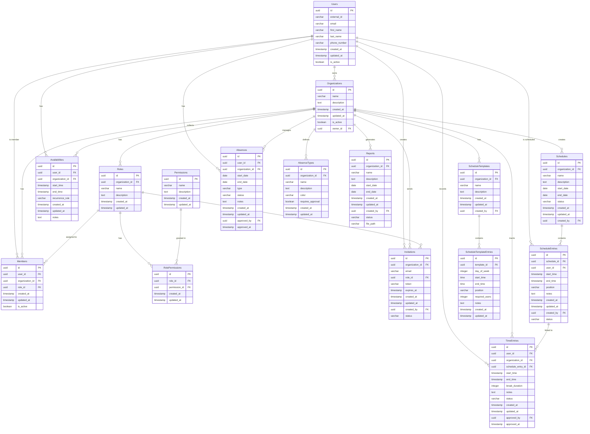

```mermaid
erDiagram
    %% Schemat users
    Users {
        uuid id PK
        varchar external_id
        varchar email
        varchar first_name
        varchar last_name
        varchar phone_number
        timestamp created_at
        timestamp updated_at
        boolean is_active
    }
    
    Organizations {
        uuid id PK
        varchar name
        text description
        timestamp created_at
        timestamp updated_at
        boolean is_active
        uuid owner_id FK
    }
    
    Members {
        uuid id PK
        uuid user_id FK
        uuid organization_id FK
        uuid role_id FK
        timestamp created_at
        timestamp updated_at
        boolean is_active
    }
    
    Roles {
        uuid id PK
        uuid organization_id FK
        varchar name
        text description
        timestamp created_at
        timestamp updated_at
    }
    
    Permissions {
        uuid id PK
        varchar name
        text description
        timestamp created_at
        timestamp updated_at
    }
    
    RolePermissions {
        uuid id PK
        uuid role_id FK
        uuid permission_id FK
        timestamp created_at
        timestamp updated_at
    }
    
    Invitations {
        uuid id PK
        uuid organization_id FK
        varchar email
        uuid role_id FK
        varchar token
        timestamp expires_at
        timestamp created_at
        timestamp updated_at
        uuid created_by FK
        varchar status
    }
    
    %% Schemat schedules
    Availabilities {
        uuid id PK
        uuid user_id FK
        uuid organization_id FK
        timestamp start_time
        timestamp end_time
        varchar recurrence_rule
        timestamp created_at
        timestamp updated_at
        text notes
    }
    
    Schedules {
        uuid id PK
        uuid organization_id FK
        varchar name
        text description
        date start_date
        date end_date
        varchar status
        timestamp created_at
        timestamp updated_at
        uuid created_by FK
    }
    
    ScheduleEntries {
        uuid id PK
        uuid schedule_id FK
        uuid user_id FK
        timestamp start_time
        timestamp end_time
        varchar position
        text notes
        timestamp created_at
        timestamp updated_at
        uuid created_by FK
        varchar status
    }
    
    ScheduleTemplates {
        uuid id PK
        uuid organization_id FK
        varchar name
        text description
        timestamp created_at
        timestamp updated_at
        uuid created_by FK
    }
    
    ScheduleTemplateEntries {
        uuid id PK
        uuid template_id FK
        integer day_of_week
        time start_time
        time end_time
        varchar position
        integer required_users
        text notes
        timestamp created_at
        timestamp updated_at
    }
    
    %% Schemat timetracking
    TimeEntries {
        uuid id PK
        uuid user_id FK
        uuid organization_id FK
        uuid schedule_entry_id FK
        timestamp start_time
        timestamp end_time
        integer break_duration
        text notes
        varchar status
        timestamp created_at
        timestamp updated_at
        uuid approved_by FK
        timestamp approved_at
    }
    
    Absences {
        uuid id PK
        uuid user_id FK
        uuid organization_id FK
        date start_date
        date end_date
        varchar type
        varchar status
        text notes
        timestamp created_at
        timestamp updated_at
        uuid approved_by FK
        timestamp approved_at
    }
    
    AbsenceTypes {
        uuid id PK
        uuid organization_id FK
        varchar name
        text description
        varchar color
        boolean requires_approval
        timestamp created_at
        timestamp updated_at
    }
    
    Reports {
        uuid id PK
        uuid organization_id FK
        varchar name
        text description
        date start_date
        date end_date
        timestamp created_at
        timestamp updated_at
        uuid created_by FK
        varchar status
        varchar file_path
    }
    
    %% Relacje
    Users ||--o{ Organizations : "owns"
    Users ||--o{ Members : "is member"
    Users ||--o{ Invitations : "creates"
    Users ||--o{ Availabilities : "has"
    Users ||--o{ ScheduleEntries : "is scheduled"
    Users ||--o{ TimeEntries : "records"
    Users ||--o{ Absences : "has"
    
    Organizations ||--o{ Members : "has"
    Organizations ||--o{ Roles : "has"
    Organizations ||--o{ Invitations : "sends"
    Organizations ||--o{ Availabilities : "collects"
    Organizations ||--o{ Schedules : "creates"
    Organizations ||--o{ ScheduleTemplates : "has"
    Organizations ||--o{ TimeEntries : "tracks"
    Organizations ||--o{ Absences : "manages"
    Organizations ||--o{ AbsenceTypes : "defines"
    Organizations ||--o{ Reports : "generates"
    
    Roles ||--o{ Members : "assigned to"
    Roles ||--o{ Invitations : "offered in"
    Roles ||--o{ RolePermissions : "has"
    
    Permissions ||--o{ RolePermissions : "granted in"
    
    Schedules ||--o{ ScheduleEntries : "contains"
    
    ScheduleTemplates ||--o{ ScheduleTemplateEntries : "contains"
    
    ScheduleEntries ||--o{ TimeEntries : "linked to"
``` 
