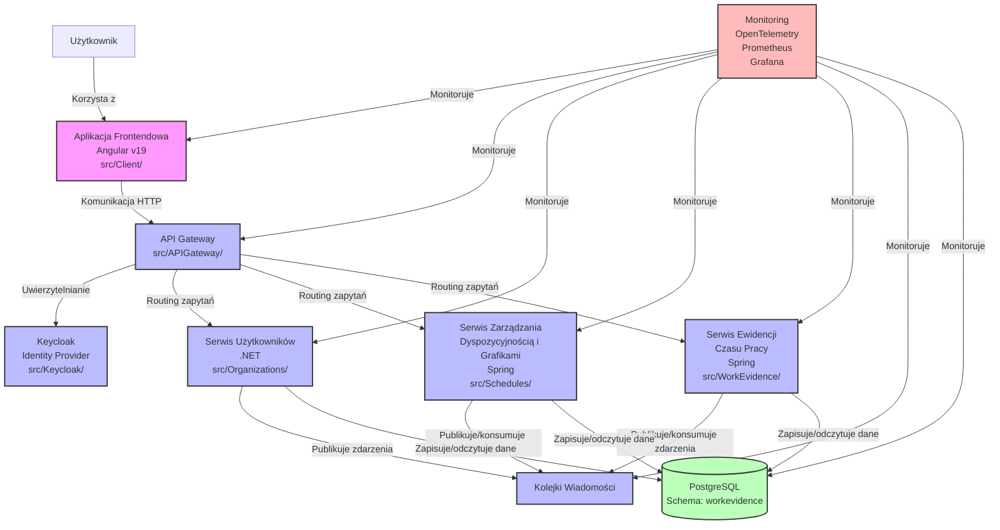

```mermaid
graph TD
    User[Użytkownik] -->|Korzysta z| Frontend[Aplikacja Frontendowa\nAngular v19\nsrc/Client/]
    
    Frontend -->|Komunikacja HTTP| Gateway[API Gateway\nsrc/APIGateway/]
    
    Gateway -->|Uwierzytelnianie| Keycloak[Keycloak\nIdentity Provider\nsrc/Keycloak/]
    
    Gateway -->|Routing zapytań| UserService[Serwis Użytkowników\n.NET\nsrc/Organizations/]
    Gateway -->|Routing zapytań| SchedulesService[Serwis Zarządzania\nDyspozycyjnością i Grafikami\nSpring\nsrc/Schedules/]
    Gateway -->|Routing zapytań| WorkEvidenceService[Serwis Ewidencji\nCzasu Pracy\nSpring\nsrc/WorkEvidence/]
    
    UserService -->|Publikuje zdarzenia| MessageQueue[Kolejki Wiadomości]
    SchedulesService -->|Publikuje/konsumuje zdarzenia| MessageQueue
    WorkEvidenceService -->|Publikuje/konsumuje zdarzenia| MessageQueue
    
    UserService -->|Zapisuje/odczytuje dane| Database[(PostgreSQL\nSchema: users)]
    SchedulesService -->|Zapisuje/odczytuje dane| Database[(PostgreSQL\nSchema: schedules)]
    WorkEvidenceService -->|Zapisuje/odczytuje dane| Database[(PostgreSQL\nSchema: workevidence)]
    
    Monitoring[Monitoring\nOpenTelemetry\nPrometheus\nGrafana] -->|Monitoruje| Frontend
    Monitoring -->|Monitoruje| Gateway
    Monitoring -->|Monitoruje| UserService
    Monitoring -->|Monitoruje| SchedulesService
    Monitoring -->|Monitoruje| WorkEvidenceService
    Monitoring -->|Monitoruje| MessageQueue
    Monitoring -->|Monitoruje| Database
    
    classDef frontend fill:#f9f,stroke:#333,stroke-width:2px;
    classDef backend fill:#bbf,stroke:#333,stroke-width:2px;
    classDef database fill:#bfb,stroke:#333,stroke-width:2px;
    classDef monitoring fill:#fbb,stroke:#333,stroke-width:2px;
    
    class Frontend frontend;
    class Gateway,UserService,SchedulesService,WorkEvidenceService,Keycloak,MessageQueue backend;
    class Database database;
    class Monitoring monitoring;
``` 
