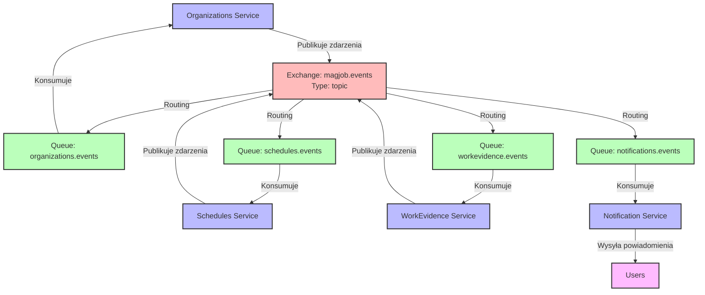

```mermaid
graph TD
    %% Mikrousługi
    Organizations[Organizations Service] -->|Publikuje zdarzenia| EventsExchange
    Schedules[Schedules Service] -->|Publikuje zdarzenia| EventsExchange
    WorkEvidence[WorkEvidence Service] -->|Publikuje zdarzenia| EventsExchange
    
    %% Wymiany
    EventsExchange[Exchange: magjob.events\nType: topic] -->|Routing| OrganizationsQueue
    EventsExchange -->|Routing| SchedulesQueue
    EventsExchange -->|Routing| WorkEvidenceQueue
    EventsExchange -->|Routing| NotificationsQueue
    
    %% Kolejki
    OrganizationsQueue[Queue: organizations.events] -->|Konsumuje| Organizations
    SchedulesQueue[Queue: schedules.events] -->|Konsumuje| Schedules
    WorkEvidenceQueue[Queue: workevidence.events] -->|Konsumuje| WorkEvidence
    NotificationsQueue[Queue: notifications.events] -->|Konsumuje| NotificationService
    
    %% Serwis powiadomień
    NotificationService[Notification Service] -->|Wysyła powiadomienia| Users
    
    %% Użytkownicy
    Users[Users]
    
    %% Style
    classDef service fill:#bbf,stroke:#333,stroke-width:2px;
    classDef exchange fill:#fbb,stroke:#333,stroke-width:2px;
    classDef queue fill:#bfb,stroke:#333,stroke-width:2px;
    classDef user fill:#fbf,stroke:#333,stroke-width:2px;
    
    class Organizations,Schedules,WorkEvidence,NotificationService service;
    class EventsExchange exchange;
    class OrganizationsQueue,SchedulesQueue,WorkEvidenceQueue,NotificationsQueue queue;
    class Users user;
```

Ten diagram przedstawia architekturę systemu kolejek wiadomości w projekcie MagJob, pokazując przepływ zdarzeń między mikrousługami za pośrednictwem RabbitMQ. 
