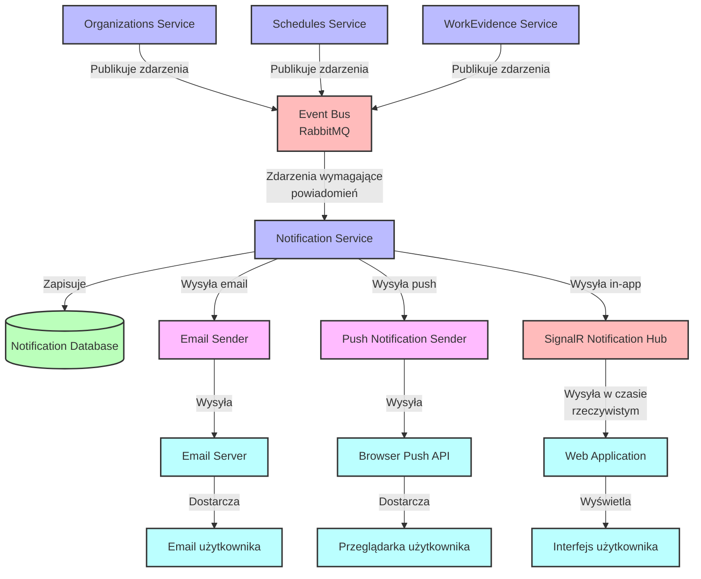

```mermaid
graph TD
    %% Źródła zdarzeń
    Organizations[Organizations Service] -->|Publikuje zdarzenia| EventBus
    Schedules[Schedules Service] -->|Publikuje zdarzenia| EventBus
    WorkEvidence[WorkEvidence Service] -->|Publikuje zdarzenia| EventBus
    
    %% Event Bus
    EventBus[Event Bus\nRabbitMQ] -->|Zdarzenia wymagające\npowiadomień| NotificationService
    
    %% Serwis powiadomień
    NotificationService[Notification Service] -->|Zapisuje| NotificationDB
    NotificationService -->|Wysyła email| EmailSender
    NotificationService -->|Wysyła push| PushSender
    NotificationService -->|Wysyła in-app| NotificationHub
    
    %% Komponenty wysyłające
    EmailSender[Email Sender] -->|Wysyła| EmailServer
    PushSender[Push Notification Sender] -->|Wysyła| BrowserPush
    NotificationHub[SignalR Notification Hub] -->|Wysyła w czasie\nrzeczywistym| WebApp
    
    %% Odbiorcy
    EmailServer[Email Server] -->|Dostarcza| UserEmail[Email użytkownika]
    BrowserPush[Browser Push API] -->|Dostarcza| UserBrowser[Przeglądarka użytkownika]
    WebApp[Web Application] -->|Wyświetla| UserInterface[Interfejs użytkownika]
    
    %% Baza danych
    NotificationDB[(Notification Database)]
    
    %% Style
    classDef service fill:#bbf,stroke:#333,stroke-width:2px;
    classDef database fill:#bfb,stroke:#333,stroke-width:2px;
    classDef messaging fill:#fbb,stroke:#333,stroke-width:2px;
    classDef sender fill:#fbf,stroke:#333,stroke-width:2px;
    classDef receiver fill:#bff,stroke:#333,stroke-width:2px;
    
    class Organizations,Schedules,WorkEvidence,NotificationService service;
    class NotificationDB database;
    class EventBus,NotificationHub messaging;
    class EmailSender,PushSender sender;
    class EmailServer,BrowserPush,WebApp,UserEmail,UserBrowser,UserInterface receiver;
```

Ten diagram przedstawia architekturę systemu powiadomień w projekcie MagJob, pokazując przepływ powiadomień od źródeł zdarzeń do użytkowników końcowych poprzez różne kanały (email, push, in-app). 
